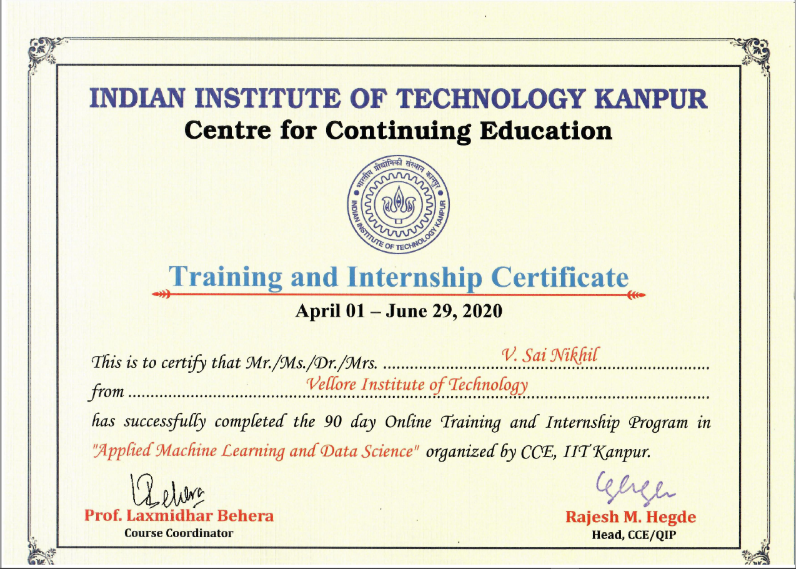

# Machine-Learning-and-Data-Science-IIT-Kanpur

This is my intern course on Applied Machine Learning and Data Science from IIT-Kanpur. This course started on April 01 to June 29, which is a 3 month course. The mode of course is online using the Google Classroom platform. The topic incude:
* Python Foundation
* Data Wrangling
* Storytelling with Data
* Introduction to Machine Learning
* Deep Learning in Depth
* Statistics for Data Science
* NLP Toolkit
The course was thought by faculties from IIT-Kanpur and after completion of course there was a capstone project on reserach paper and verified by the team.

## Abstract on Capstone Project
We have many face detection methods for detecting the face of human. It is used in many industries, classrooms, offices and other places for security reasons. Usually this surveillance will detect human faces. In our project we do both detection of human face and also recognize the persons face.

This face detection project tackle the main problem of working in real world environment since it has high rate of accuracy and run in real time system. We store the persons image in the dataset and use the system to train these images and detect and recognize the human face. Not only this detect the single face in the frame, but also multiple faces in the image frame.

## Certificate From Completion

